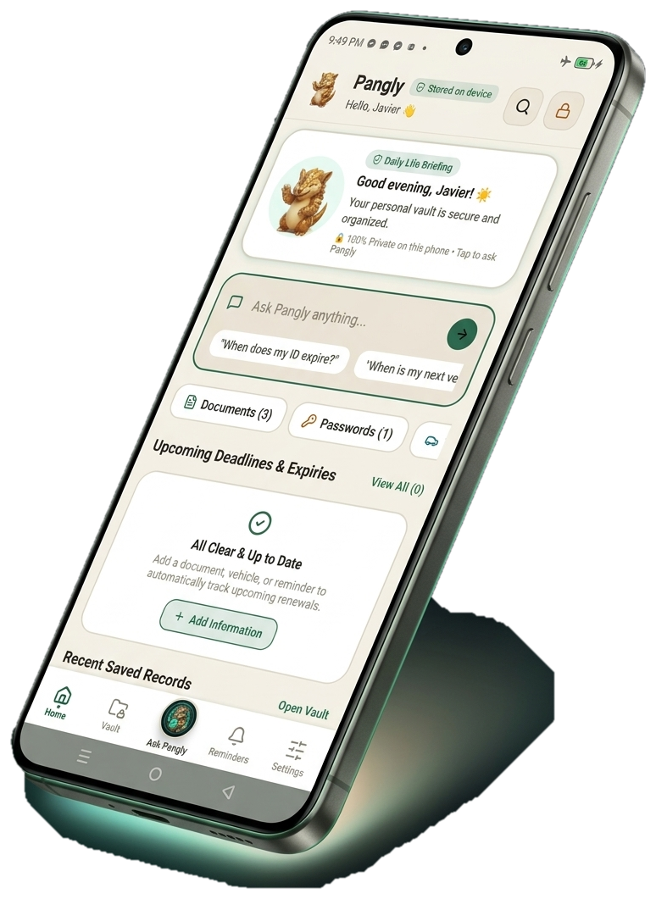
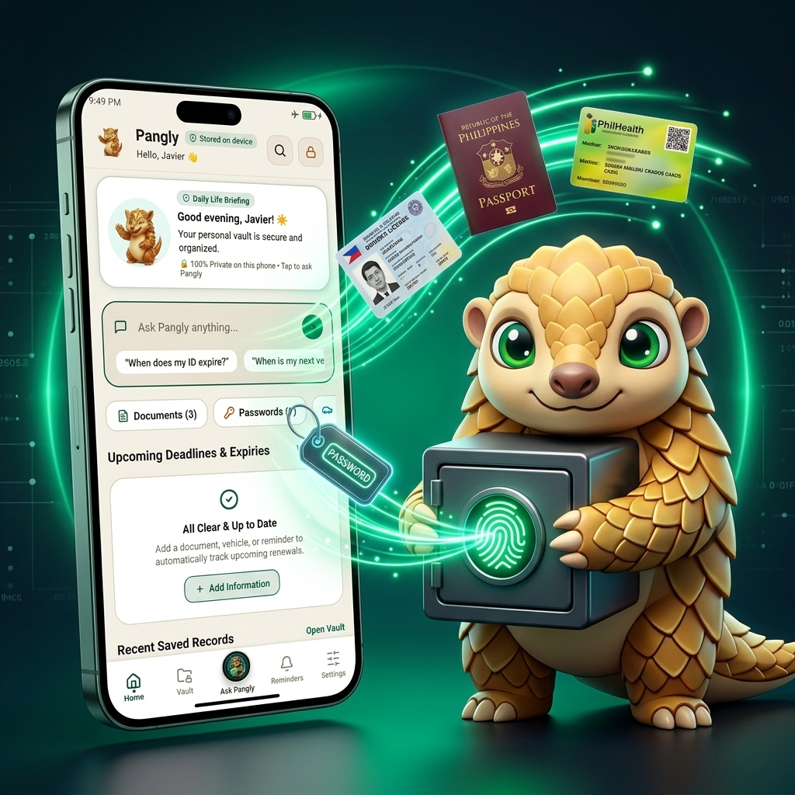

  

  # Pangly
  **Store it. Ask it. Own it**

  

    <a href="#what-is-pangly">What is Pangly?</a> •
    <a href="#key-features">Key Features</a> •
    <a href="#why-zero-cloud-matters">Why Zero-Cloud?</a> •
    <a href="#how-to-install">How to Install</a> •
    <a href="#frequently-asked-questions">FAQ</a>
  

---

## What is Pangly?

Tired of digging through hundreds of photos in your gallery every time you need your PhilID, Driver's License, or SSS number at a bank or government office?

**Pangly** is a fast, secure, and private mobile app designed specifically for Filipinos. It organizes your Philippine IDs, documents, and passwords into an encrypted vault stored directly on your phone — with **zero cloud uploads** and **no internet required**.

  

---

## Key Features

### 1. Tailored for Philippine Documents
Easily store, view, and organize all your essential identification cards and papers in one place:
* **Government IDs:** PhilID (National ID), Driver’s License, Passport, PRC ID, SSS, PhilHealth, UMID, Postal ID, Voter's ID.
* **Family & Benefits:** Senior Citizen and PWD booklets, medicine discount tracking.
* **Vehicles & Legal:** LTO OR/CR vehicle registrations, insurance policies, and billing statements.
* **Automatic Text Reading (OCR):** Pangly reads the numbers from your cards so you can copy and paste your ID numbers with a single tap.

  

---

### 2. Built-in Offline AI Assistant
Ask questions in plain English or Taglish about your stored documents and get instant answers — even on airplane mode or during power outages:
* *"What is my driver's license expiration date?"*
* *"What is the plate number and chassis number on my LTO registration?"*
* *"Show my SSS number for my employer."*

Because the AI runs entirely on your phone's hardware, your questions and documents are **never** sent to any external server.

  

---

### 3. Zero-Cloud Security
Unlike traditional password managers and cloud backup drives that upload your sensitive documents to foreign servers:
* **100% Stored on Your Phone:** Your files never leave your device.
* **Biometric Protection:** Locked behind your fingerprint or Face Unlock.
* **Bank-Grade Encryption:** Protected with AES-256 encryption using your phone's secure hardware chip.

  

---

## Why Zero-Cloud Matters

| Traditional Cloud Apps | Pangly |
| :--- | :--- |
| Uploads your sensitive IDs to public servers | Files stay 100% inside your phone's memory |
| Risk of corporate data leaks and identity theft | Zero servers to hack — you own your data |
| Requires continuous internet or monthly subscription | Works completely offline without any fees |
| Sells data or collects tracking analytics | Zero tracking, zero telemetry, zero ads |

---

## How to Install (Android)

Installing Pangly is simple and takes less than a minute:

1. **Download the App:** Tap the **Download APK** button on the Pangly website or download the latest package from our [Releases page](https://github.com/JavierSiliacay/pangly-website/releases).
2. **Tap "Download Anyway":** Android displays a standard security notice for apps downloaded directly outside Google Play. Tap **Download anyway**.
3. **Open & Install:** Tap the finished download from your notification bar, enable **"Allow from this source"** if prompted, and tap **Install**.
4. **Set Up Biometrics:** Open Pangly and enable Fingerprint or PIN security to start adding your IDs safely.

  

---

## Frequently Asked Questions

#### Is Pangly really 100% private?
Yes. Pangly was built from the ground up with a zero-cloud philosophy. It does not have remote databases, does not require an email registration, and does not upload your scanned cards anywhere.

#### Does it work without Wi-Fi or data?
Yes. All scanning, optical character recognition (OCR), encrypted storage, and AI question-answering happen locally on your smartphone processor.

#### Why is the app provided as an APK download?
During our early pilot release, we distribute Pangly directly to our early community testers to ensure quick updates and direct feedback without third-party app store delays.

---

  
  
<strong>Pangly — Private, smart, and built for the Philippines.</strong>

