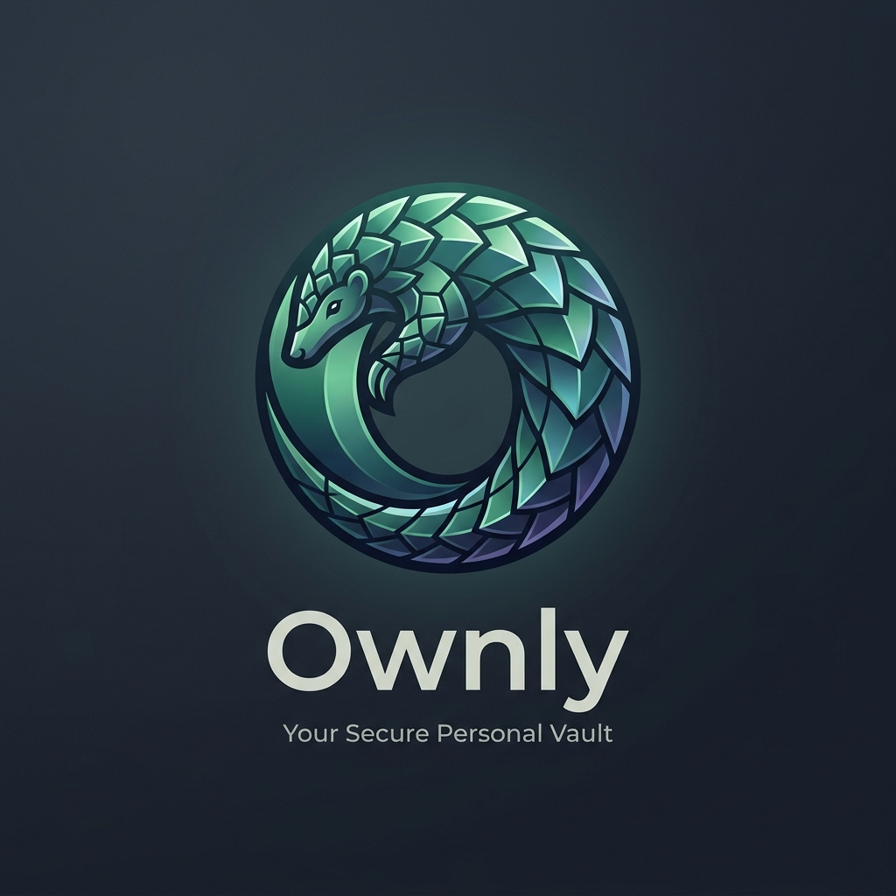

<div align="center">

  

  # Pangly Official Website
  **The Zero-Cloud, On-Device Document Vault & Offline Assistant for the Philippines**

  [](https://nextjs.org/)
  [](https://www.typescriptlang.org/)
  [](https://www.framer.com/motion/)
  [](https://github.com/JavierSiliacay/pangly-website/releases)

  <p align="center">
    <a href="#about-the-project">About</a> •
    <a href="#key-features">Features</a> •
    <a href="#tech-stack">Tech Stack</a> •
    <a href="#project-structure">Project Structure</a> •
    <a href="#getting-started">Getting Started</a> •
    <a href="#apk-distribution">APK Distribution</a> •
    <a href="#deployment">Deployment</a>
  </p>

</div>

---

## About the Project

The official web portal and early-access pilot distribution platform for **Pangly** — an on-device, private document manager built specifically for Philippine IDs and documents with local AI processing and zero-cloud architecture.

### Website Capabilities:
* **Interactive Live Demo**: An in-browser simulated document vault and chat assistant allowing visitors to test Pangly's user experience before downloading.
* **Pilot Quota & Slot Claiming**: A dynamic 100-tester early access slot issuing system with duplicate detection and client token persistence.
* **Direct APK Distribution**: Streamlined APK delivery connected to GitHub Releases without third-party app store friction.
* **Step-by-Step Sideloading Guide**: Visual installation guide tailored for Android users.
* **Security & Architecture Comparison**: Breakdown against conventional cloud-based password and document managers.

---

## Key Features

| Module | Purpose |
| :--- | :--- |
| **Philippine Document Vault** | Highlights auto-OCR and high-resolution indexing for PhilID, Passports, PRC, SSS, Senior/PWD booklets, and LTO OR/CR. |
| **On-Device AI Engine** | Explains 100% offline local neural query processing with zero telemetry. |
| **Zero-Cloud Keystore** | Explains Android Hardware Keystore AES-256 local database encryption. |
| **Slot Allocation Engine** | REST API (`/api/slots`) managing real-time slots, browser tokens, and re-download capability. |
| **Sideloading Guide** | Clear step-by-step visual aid for Android direct package installations. |

---

## Tech Stack

* **Framework:** Next.js (App Router, Server Components & Route Handlers)
* **Language:** TypeScript
* **Styling:** Custom CSS Design System with warm earthy palette (`#2D6A4F`, `#F5F1EB`, `#E76F51`)
* **Animations:** Framer Motion & Lucide Icons
* **Data Persistence:** Atomic JSON-based slot state manager (`src/lib/slotStorage.ts`)

---

## Project Structure

```text
pangly-website/
├── public/
│   ├── images/          # Product visual mockups, mascots, and UI assets
│   ├── sounds/          # Interactive audio feedback
│   └── downloads/       # Local APK placeholder (git-ignored)
├── src/
│   ├── app/
│   │   ├── api/
│   │   │   ├── download/   # Direct APK download redirect handler
│   │   │   └── slots/      # Real-time slot allocation & token verification
│   │   ├── globals.css     # Design tokens, typography, and responsive utilities
│   │   ├── layout.tsx      # SEO metadata, OpenGraph tags, and layout shell
│   │   └── page.tsx        # Main landing page composition
│   ├── components/         # Hero, Navbar, InteractiveDemo, FeatureTour, etc.
│   └── lib/                # Slot storage management logic
└── README.md
```

---

## Getting Started

### 1. Prerequisites
* **Node.js**: `v18.18.0` or higher
* **Package Manager**: `npm`, `pnpm`, or `yarn`

### 2. Installation
```bash
git clone https://github.com/JavierSiliacay/pangly-website.git
cd pangly-website
npm install
```

### 3. Environment Variables (Optional)
To customize the APK release URL, create a `.env.local` file:
```env
NEXT_PUBLIC_APK_DOWNLOAD_URL="https://github.com/JavierSiliacay/pangly-website/releases/download/v1.3.20/Pangly_v1.3.20.apk"
```

### 4. Running Locally
```bash
npm run dev
```
Open [http://localhost:3000](http://localhost:3000) to view the site.

---

## APK Distribution

Because GitHub repositories enforce a 100 MB limit per commit, the **226 MB** APK binary is distributed via **GitHub Releases**:
1. Releases are published under the repository's `Releases` tab with tag `v1.3.20`.
2. When users click **"Claim Slot & Download"** on the website, `/api/download` silently redirects to the release binary asset directly.
3. Users receive an instant 1-click download directly in their browser without leaving the website.

---

## Deployment

Deploy to **Vercel**:
1. Import this GitHub repository into [Vercel](https://vercel.com).
2. Configure any optional environment variables (`NEXT_PUBLIC_APK_DOWNLOAD_URL`).
3. Click **Deploy**.

---

<div align="center">
  <sub>Pangly — Zero-cloud document security for the Philippines.</sub>
</div>
